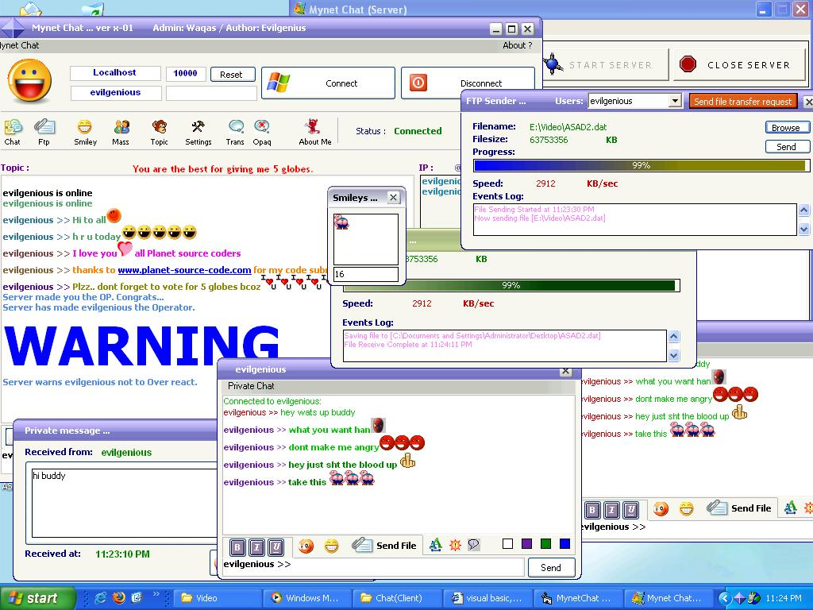



## Winsock Complete Chat With Smileys and many more

### Description

This is a complete chat program with smileys,private chat,file transfer,chat font change,chat color change,hyperlink support,kick,banned,warning,nudge and many more. This software is tested on LAN. It supports Multiple networks that vypress,realpop and others dont support.You can include as many smileys as you want by giving smiley a number.Best file transfer(Binary Transfer Ocx from PSC),Fast conversion of code into smileys that you have never seen.All you have got in one. enjoy ...

Remember: Port no = 10000 for server
 
### More Info
 

             |
---                |---
**Submitted On**   |2005-06-04 15:25:04
**By**             |[Evilgenious](https://github.com/Planet-Source-Code/PSCIndex/blob/master/ByAuthor/evilgenious.md)
**Level**          |Advanced
**User Rating**    |4.9 (162 globes from 33 users)
**Compatibility**  |VB 6\.0
**Category**       |[Complete Applications](https://github.com/Planet-Source-Code/PSCIndex/blob/master/ByCategory/complete-applications__1-27.md)
**World**          |[Visual Basic](https://github.com/Planet-Source-Code/PSCIndex/blob/master/ByWorld/visual-basic.md)
**Archive File**   |[Winsock\_Co189680642005\.zip](https://github.com/Planet-Source-Code/evilgenious-winsock-complete-chat-with-smileys-and-many-more__1-60897/archive/master.zip)

